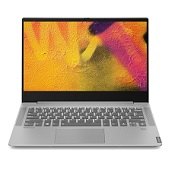
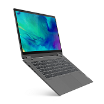
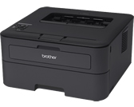

# Contexto del Proyecto: MetaDrivers - Inventario de Oficina Metagroup

## 📌 Descripción General
Este archivo documenta el registro y contexto de los equipos tecnológicos de la oficina de **Metagroup**, incluyendo especificaciones clave (marca, modelo, tipo de equipo), número de serie o activo, responsable o ubicación física, imágenes de referencia de los equipos, especificaciones técnicas de hardware (**CPU**, **RAM**, **GPU**), **credenciales de acceso de Windows (Usuario y Contraseña)**, **observaciones técnicas e historial**, y enlaces directos para la descarga de controladores (drivers) oficiales.

La base de datos principal estructurada reside en el archivo [`equipos.json`](file:///c:/Users/Rod/Desktop/code/MetaDrivers/equipos.json) y se administra interactivamente a través de la aplicación web local `MetaDrivers` (`index.html`, `style.css`, `app.js`).

---

## ⚠️ Directiva de Desarrollo y Alcance (Regla Estricta)
> **REGLA FUNDAMENTAL:**
> Evitar estrictamente cambiar, crear o implementar funcionalidades, textos o componentes que no vayan en directa y exclusiva relación con lo que el usuario solicita puntualmente.
> - No asumir requerimientos no pedidos.
> - No agregar elementos estéticos ni funcionales que no hayan sido solicitados expresamente.
> - No alterar partes del sistema ni comportamientos fuera del alcance directo de la petición actual.

---

## 💻 Resumen de Equipos Registrados

| # | Tipo | Marca | Modelo | Fabricación / Lanzamiento | CPU | RAM | GPU | Usuario Windows | Serie / Activo | Enlace a Drivers / Soporte |
|---|------|-------|--------|---------------------------|-----|-----|-----|-----------------|----------------|----------------------------|
| 1 | Laptop | Lenovo | IdeaPad S540-14API (Juan Pérez) | `2019-06-14` | AMD Ryzen 5 3500U (4C/8T @ 2.1-3.7 GHz) [2019] | 12 GB DDR4 2400 MHz (Dual-Ch) | AMD Radeon Vega 8 (Integrada) | `metagroup\jperez` | MP1L968Y | [Drivers Oficiales Lenovo S540-14API (81NH)](https://pcsupport.lenovo.com/products/laptops-and-netbooks/ideapad-s-series-laptops/s540-14api/81nh/downloads) |
| 2 | Laptop | Lenovo | IdeaPad S540-14API (Usuario 2) | `2019-08-27` | AMD Ryzen 5 3500U (4C/8T @ 2.1-3.7 GHz) [2019] | 12 GB DDR4 2400 MHz (Dual-Ch) | AMD Radeon Vega 8 (Integrada) | `metagroup\usuario2` | MP1MXEKF | [Drivers Oficiales Lenovo S540-14API (81NH)](https://pcsupport.lenovo.com/products/laptops-and-netbooks/ideapad-s-series-laptops/s540-14api/81nh/downloads) |
| 3 | Laptop | Lenovo | IdeaPad S540-14API (Héctor) | `2019-06-14` | AMD Ryzen 5 3500U (4C/8T @ 2.1-3.7 GHz) [2019] | 12 GB DDR4 2400 MHz (Dual-Ch) | AMD Radeon Vega 8 (Integrada) | `metagroup\hector` | MP1L972A | [Drivers Oficiales Lenovo S540-14API (81NH)](https://pcsupport.lenovo.com/products/laptops-and-netbooks/ideapad-s-series-laptops/s540-14api/81nh/downloads) |
| 4 | Laptop | Lenovo | IdeaPad Flex 5 14ARE05 (Zeta) | `2021-03-26` | AMD Ryzen 5 4500U (6C/6T @ 2.3-4.0 GHz) [2020] | 8 GB DDR4 3200 MHz (Soldada) | AMD Radeon Graphics (Integrada) | `metagroup\zeta` | R9126WCC | [Drivers Oficiales Lenovo Flex 5 14ARE05 (81X2)](https://pcsupport.lenovo.com/products/laptops-and-netbooks/flex-series/flex-5-14are05/81x2/downloads) |
| 5 | Laptop | Lenovo | IdeaPad Flex 5 14ARE05 (Isa) | `2021` *(Serie: 2020)* | AMD Ryzen 5 4500U (6C/6T @ 2.3-4.0 GHz) [2020] | 8 GB DDR4 3200 MHz (Soldada) | AMD Radeon Graphics (Integrada) | `metagroup\isa` | *(Pendiente)* | [Drivers Oficiales Lenovo Flex 5 14ARE05 (81X2)](https://pcsupport.lenovo.com/products/laptops-and-netbooks/flex-series/flex-5-14are05/81x2/downloads) |
| 6 | Impresora | Brother | HL-L2360DW | `2014` *(Lanzamiento)* | N/A (Láser Monocromática) | 32 MB Estándar | N/A | N/A | E74288J6N123456 | [Descarga de Drivers Brother HL-L2360DW](https://support.brother.com/g/b/downloadlist.aspx?c=mx&lang=es&prod=hll2360dw_us&os=10068) |

---

## 📋 Fichas Técnicas Detalladas de Equipos

### 1. Lenovo IdeaPad S540-14API - Juan Pérez (S/N: MP1L968Y)

- **Tipo:** Laptop
- **Marca y Línea:** Lenovo IdeaPad
- **Modelo:** IdeaPad S540-14API
- **Nombre de Modelo (Model Name):** 81NH
- **Número de Serie (S/N):** MP1L968Y
- **Machine Type Model (MTM):** 81NH000PCL
- **Código MO:** MPNXB9610019
- **Fecha de Fabricación / Lanzamiento:** `2019-06-14` (14 de junio de 2019)
- **ID de Fábrica:** PRC4
- **Alimentación (Input):** 20 V === 3.25 A (cargador de 65 W)
- **Origen:** Fabricado en China para Lenovo PC HK Limited
- **Usuario(s) Asignado(s):** Juan Pérez
- **Ubicación:** Oficina Metagroup
- **Credenciales Windows:**
  - *Usuario:* `metagroup\jperez`
  - *Contraseña:* `MetaGroup2026!`
- **Especificaciones de Hardware:**
  - **Procesador (CPU):** AMD Ryzen 5 3500U
    - *Núcleos e Hilos:* 4 núcleos físicos / 8 hilos de procesamiento
    - *Frecuencias:* 2100 MHz (2.1 GHz) Base / 3700 MHz (3.7 GHz) Turbo Boost
    - *Año de salida:* 2019
    - *Características:* Arquitectura Zen+ (Picasso), litografía de 12nm FinFET, 4 MB Caché L3, TDP de 15W
  - **Memoria RAM:** 12 GB DDR4
    - *Frecuencia:* 2400 MHz
    - *Configuración:* 4 GB soldados en placa + 8 GB en módulo SO-DIMM (Dual-Channel activo)
  - **Tarjeta Gráfica (GPU):** AMD Radeon Vega 8 Graphics
    - *Tipo:* **Integrada**
    - *Características:* 8 núcleos de cómputo GPU (1200 MHz), memoria de video compartida
  - **Almacenamiento:** 256 GB SSD M.2 PCIe NVMe
- **Enlace de Drivers:** [Lenovo PC Support - IdeaPad S540-14API (Type 81NH)](https://pcsupport.lenovo.com/products/laptops-and-netbooks/ideapad-s-series-laptops/s540-14api/81nh/downloads)
- **Licencia Microsoft Office:**
  - *Estado:* Activa
  - *Tipo / Versión:* Microsoft 365 Business Standard
  - *Observaciones / Cuenta:* Licencia Office corporativa activa
- **Observaciones:** Equipo asignado con suite Office y antivirus corporativo. Chasis de aluminio en perfecto estado.

---

### 2. Lenovo IdeaPad S540-14API - Usuario 2 (S/N: MP1MXEKF)

- **Tipo:** Laptop
- **Marca y Línea:** Lenovo IdeaPad
- **Modelo:** IdeaPad S540-14API
- **Nombre de Modelo (Model Name):** 81NH
- **Número de Serie (S/N):** MP1MXEKF
- **Machine Type Model (MTM):** 81NH000PCL
- **Código MO:** MPNXB98270CD
- **Fecha de Fabricación / Lanzamiento:** `2019-08-27` (27 de agosto de 2019)
- **ID de Fábrica:** PRC4
- **Alimentación (Input):** 20 V === 3.25 A (cargador de 65 W)
- **Origen:** Fabricado en China para Lenovo PC HK Limited
- **Usuario(s) Asignado(s):** Usuario 2
- **Ubicación:** Oficina Metagroup
- **Credenciales Windows:**
  - *Usuario:* `metagroup\usuario2`
  - *Contraseña:* `MetaGroup2026!`
- **Especificaciones de Hardware:**
  - **Procesador (CPU):** AMD Ryzen 5 3500U
    - *Núcleos e Hilos:* 4 núcleos físicos / 8 hilos de procesamiento
    - *Frecuencias:* 2100 MHz (2.1 GHz) Base / 3700 MHz (3.7 GHz) Turbo Boost
    - *Año de salida:* 2019
    - *Características:* Arquitectura Zen+ (Picasso), litografía de 12nm FinFET, 4 MB Caché L3, TDP de 15W
  - **Memoria RAM:** 12 GB DDR4
    - *Frecuencia:* 2400 MHz
    - *Configuración:* 4 GB soldados en placa + 8 GB en módulo SO-DIMM (Dual-Channel activo)
  - **Tarjeta Gráfica (GPU):** AMD Radeon Vega 8 Graphics
    - *Tipo:* **Integrada**
    - *Características:* 8 núcleos de cómputo GPU (1200 MHz), memoria de video compartida
  - **Almacenamiento:** 256 GB SSD M.2 PCIe NVMe
- **Enlace de Drivers:** [Lenovo PC Support - IdeaPad S540-14API (Type 81NH)](https://pcsupport.lenovo.com/products/laptops-and-netbooks/ideapad-s-series-laptops/s540-14api/81nh/downloads)
- **Licencia Microsoft Office:**
  - *Estado:* Activa
  - *Tipo / Versión:* Microsoft 365 Business Standard
  - *Observaciones / Cuenta:* Licencia Office corporativa activa
- **Observaciones:** Equipo en excelente estado. Chasis de aluminio corte diamante. Mantenimiento al día.
- **Fotografías del Equipo:**
  - `img/s540_mp1mxekf_serie.jpg`: *Serie (MP1MXEKF) e Input 20V*
  - `img/s540_mp1mxekf_modelo.jpg`: *Modelo, MTM y MO (81NH / MPNXB98270CD)*

---

### 3. Lenovo IdeaPad S540-14API - Héctor (S/N: MP1L972A)

- **Tipo:** Laptop
- **Marca y Línea:** Lenovo IdeaPad
- **Modelo:** IdeaPad S540-14API
- **Nombre de Modelo (Model Name):** 81NH
- **Número de Serie (S/N):** MP1L972A
- **Machine Type Model (MTM):** 81NH000PCL
- **Código MO:** MPNXB9610019
- **Fecha de Fabricación / Lanzamiento:** `2019-06-14` (14 de junio de 2019)
- **ID de Fábrica:** PRC4
- **Alimentación (Input):** 20 V === 3.25 A (65 W)
- **Origen:** Fabricado en China para Lenovo PC HK Limited
- **Usuario(s) Asignado(s):** Héctor
- **Ubicación:** Oficina Metagroup
- **Credenciales Windows:**
  - *Usuario:* `metagroup\hector`
  - *Contraseña:* `MetaGroup2026!`
- **Especificaciones de Hardware:**
  - **Procesador (CPU):** AMD Ryzen 5 3500U
    - *Núcleos e Hilos:* 4 núcleos físicos / 8 hilos de procesamiento
    - *Frecuencias:* 2100 MHz (2.1 GHz) Base / 3700 MHz (3.7 GHz) Turbo Boost
    - *Año de salida:* 2019
    - *Características:* Arquitectura Zen+ (Picasso), litografía de 12nm FinFET, 4 MB Caché L3, TDP de 15W
  - **Memoria RAM:** 12 GB DDR4
    - *Frecuencia:* 2400 MHz
    - *Configuración:* 4 GB soldados en placa + 8 GB en módulo SO-DIMM (Dual-Channel activo)
  - **Tarjeta Gráfica (GPU):** AMD Radeon Vega 8 Graphics
    - *Tipo:* **Integrada**
    - *Características:* 8 núcleos de cómputo GPU (1200 MHz), memoria de video compartida
  - **Almacenamiento:** 256 GB SSD M.2 PCIe NVMe
- **Enlace de Drivers:** [Lenovo PC Support - IdeaPad S540-14API (Type 81NH)](https://pcsupport.lenovo.com/products/laptops-and-netbooks/ideapad-s-series-laptops/s540-14api/81nh/downloads)
- **Licencia Microsoft Office:**
  - *Estado:* Activa
  - *Tipo / Versión:* Microsoft 365 Business Standard
  - *Observaciones / Cuenta:* Licencia Office corporativa activa
- **Observaciones:** Equipo asignado al usuario Héctor. Chasis de aluminio en óptimas condiciones. Configuración y antivirus corporativo al día.
- **Fotografías del Equipo:**
  - `img/hector_s540_modelo.jpg`: *Modelo y MTM (81NH / 81NH000PCL)*
  - `img/hector_s540_serie.jpg`: *Serie (MP1L972A) e Input 20V*
  - `img/hector_s540_chasis.jpg`: *Mfg Date (19/06/14) y MO*

---

### 4. Lenovo IdeaPad Flex 5 14ARE05 - Zeta (S/N: R9126WCC)

- **Tipo:** Laptop 2-en-1 / Convertible
- **Marca y Línea:** Lenovo IdeaPad Flex
- **Modelo:** IdeaPad Flex 5 14ARE05
- **Nombre de Modelo (Model Name):** 81X2
- **Número de Serie (S/N):** R9126WCC
- **Machine Type Model (MTM):** 81X200E2CC
- **Código MO:** R9N0B132600B
- **Fecha de Fabricación / Lanzamiento:** `2021-03-26` (26 de marzo de 2021)
- **ID de Fábrica:** KS
- **Alimentación (Input):** 20 V === 3.25 A (cargador de 65 W)
- **Origen:** Fabricado en China para Lenovo (Manufactured for Lenovo - Made in China)
- **Usuario(s) Asignado(s):** Zeta
- **Ubicación:** Oficina Metagroup
- **Credenciales Windows:**
  - *Usuario:* `metagroup\zeta`
  - *Contraseña:* `MetaFlex*2026`
- **Especificaciones de Hardware:**
  - **Procesador (CPU):** AMD Ryzen 5 4500U
    - *Núcleos e Hilos:* 6 núcleos físicos / 6 hilos
    - *Frecuencias:* 2300 MHz (2.3 GHz) Base / 4000 MHz (4.0 GHz) Turbo Boost
    - *Año de salida:* 2020
    - *Características:* Arquitectura 7nm Zen 2 (Renoir), 8 MB Caché L3, TDP de 15W
  - **Memoria RAM:** 8 GB DDR4
    - *Frecuencia:* 3200 MHz
    - *Configuración:* Memoria soldada en placa madre (Dual-Channel)
  - **Tarjeta Gráfica (GPU):** AMD Radeon Graphics (Renoir)
    - *Tipo:* **Integrada**
    - *Características:* 6 núcleos de cómputo GPU (1500 MHz), memoria de video compartida
  - **Almacenamiento:** 512 GB SSD M.2 2280 PCIe 3.0x4 NVMe
- **Enlace de Drivers:** [Lenovo PC Support - Flex 5-14ARE05 (Type 81X2)](https://pcsupport.lenovo.com/products/laptops-and-netbooks/flex-series/flex-5-14are05/81x2/downloads)
- **Licencia Microsoft Office:**
  - *Estado:* Activa
  - *Tipo / Versión:* Microsoft 365 Business Standard
  - *Observaciones / Cuenta:* Licencia Office corporativa activa
- **Observaciones:** Equipo convertible asignado a Zeta con pantalla táctil. Incluye cargador original de 65W.

---

### 5. Lenovo IdeaPad Flex 5 14ARE05 - Isa (S/N: Pendiente)

- **Tipo:** Laptop 2-en-1 / Convertible
- **Marca y Línea:** Lenovo IdeaPad Flex
- **Modelo:** IdeaPad Flex 5 14ARE05
- **Nombre de Modelo (Model Name):** 81X2
- **Número de Serie (S/N):** *Pendiente de registro*
- **Fecha de Fabricación / Lanzamiento:** `2021` *(Lanzamiento de serie: 2020)*
- **Alimentación (Input):** 20 V === 3.25 A (cargador de 65 W)
- **Origen:** Fabricado en China para Lenovo (Manufactured for Lenovo - Made in China)
- **Usuario(s) Asignado(s):** Isa
- **Ubicación:** Oficina Metagroup
- **Credenciales Windows:**
  - *Usuario:* `metagroup\isa`
  - *Contraseña:* `MetaFlex*2026`
- **Especificaciones de Hardware:**
  - **Procesador (CPU):** AMD Ryzen 5 4500U
    - *Núcleos e Hilos:* 6 núcleos físicos / 6 hilos
    - *Frecuencias:* 2300 MHz (2.3 GHz) Base / 4000 MHz (4.0 GHz) Turbo Boost
    - *Año de salida:* 2020
    - *Características:* Arquitectura 7nm Zen 2 (Renoir), 8 MB Caché L3, TDP de 15W
  - **Memoria RAM:** 8 GB DDR4
    - *Frecuencia:* 3200 MHz
    - *Configuración:* Memoria soldada en placa madre (Dual-Channel)
  - **Tarjeta Gráfica (GPU):** AMD Radeon Graphics (Renoir)
    - *Tipo:* **Integrada**
    - *Características:* 6 núcleos de cómputo GPU (1500 MHz), memoria de video compartida
  - **Almacenamiento:** 512 GB SSD M.2 2280 PCIe 3.0x4 NVMe
- **Enlace de Drivers:** [Lenovo PC Support - Flex 5-14ARE05 (Type 81X2)](https://pcsupport.lenovo.com/products/laptops-and-netbooks/flex-series/flex-5-14are05/81x2/downloads)
- **Licencia Microsoft Office:**
  - *Estado:* Activa
  - *Tipo / Versión:* Microsoft 365 Business Standard
  - *Observaciones / Cuenta:* Licencia Office corporativa activa
- **Observaciones:** Equipo convertible idéntico asignado a Isa. Chasis y pantalla táctil. Pendiente registrar números de serie y etiquetas.

---

### 6. Brother HL-L2360DW (S/N: E74288J6N123456)

- **Tipo:** Impresora
- **Marca:** Brother
- **Modelo:** HL-L2360DW
- **Número de Serie / Activo:** E74288J6N123456
- **Fecha de Fabricación / Lanzamiento:** `2014` *(Lanzamiento oficial Brother)*
- **Usuario(s) Asignado(s):** Uso Compartido / Red
- **Ubicación:** Oficina Central / Metagroup
- **Enlace de Drivers:** [Descarga Oficial de Drivers Brother HL-L2360DW](https://support.brother.com/g/b/downloadlist.aspx?c=mx&lang=es&prod=hll2360dw_us&os=10068)
- **Notas:** Impresora láser monocromática dúplex con conectividad Wi-Fi y Ethernet. Compatible con paquetes de controladores Brother y CUPS.
- **Observaciones:** Impresora compartida por red cableada y Wi-Fi en recepción. Tóner al 85%.

#### 🖨️ Registro y Control de Consumibles (Tóner y Tambor)
- **Tóner (Brother TN-2340 / TN-2370):**
  - *Último aviso de fin de tóner:* *Sin registro previo (registrar al ocurrir aviso)*
  - *Último reemplazo de tóner:* *Sin registro previo (registrar al cambiar cartucho)*
- **Unidad de Tambor / Drum (Brother DR-2340):**
  - *Último aviso de fin de tambor:* *Sin registro previo (vida útil ~10.000 páginas)*
  - *Último reemplazo de tambor:* *Sin registro previo*

#### 🛒 Opciones de Tóner y Precios en Chile
- **Tóner Brother TN-2340 (Original - 1.200 pág.):** Su precio ronda entre los $45.110 CLP y $59.476 CLP en tiendas como [LifeMax](https://www.lifemaxstore.cl/products/toner-brother-tn2340-original-hl-l2320d-a-l2360dw-dcp-l2520dw-a-l2540dw-mfc-l2700dw-al2740dw) o [Sodimac](https://www.sodimac.cl/sodimac-cl/articulo/146280995/Toner-Brother-Tn-2340-Original-L2320d-L2360dw-L2540/146280997).
- **Tóner Brother TN-2370 (Original - 2.600 pág.):** Su precio aproximado es de $68.990 CLP a $83.490 CLP en distribuidores como [LifeMax](https://www.lifemaxstore.cl/products/toner-brother-tn2370-original-hl-l2320d-a-hl-l2360dw-dcp-l2520dw-a-dcp-l2540dw-mfc-l2700dw-a-l2740dw?srsltid=AfmBOoq5EE700oKMX1QWG93DUfMr6YTodg7cfJ26En6Ot6UPxxLnj2H7).
- **Unidad de Tambor (DR-2340):** Recuerda que el tambor es independiente del tóner y rinde unas 10.000 páginas; puedes encontrar alternativas en sitios como [TodoToner](https://www.todotoner.cl/hl-l2360-1). [[1](https://www.sodimac.cl/sodimac-cl/articulo/146280995/Toner-Brother-Tn-2340-Original-L2320d-L2360dw-L2540/146280997), [2](https://listado.mercadolibre.cl/toner-brother-hl-l2360dw), [3](https://support.brother.com/g/b/cotop.aspx?c=us&lang=es&prod=hll2360dw_us), [4](https://www.todotoner.cl/hl-l2360-1)]

---

## 🛠️ Guía de Uso del Inventario y Driver Hub
1. **Base de Datos:** El archivo [`equipos.json`](file:///c:/Users/Rod/Desktop/code/MetaDrivers/equipos.json) almacena los registros de los equipos, imágenes de referencia, especificaciones de CPU, RAM, GPU, credenciales de Windows, fechas de fabricación/lanzamiento y control de consumibles.
2. **Abrir la Aplicación y Vista a Pantalla Completa:** Abre `index.html` en cualquier navegador web. Las tarjetas de la grilla presentan un diseño compacto. Al pulsar sobre cualquier tarjeta (sea laptop, desktop o impresora) se abre la **Ficha Técnica a pantalla completa en una página completa** con todas las especificaciones de hardware, credenciales, control de consumibles, observaciones, galería de fotos y enlace oficial a drivers.
3. **Ordenación y Filtros:** La barra de herramientas permite filtrar por tipo o marca y **ordenar los equipos** por:
   - **Categoría / Tipo de equipo** (Laptops, Desktops, Impresoras...)
   - **Marca** (A - Z)
   - **Modelo** (A - Z)
   - **Antigüedad (Más recientes primero o Más antiguos primero)** según su fecha de fabricación/lanzamiento.
   - **Asignación / Ubicación**
   *(El orden seleccionado se recuerda automáticamente en el navegador).*
4. **Edición Unificada de Fechas y Datos:** Para evitar redundancia y desorden, todas las fechas y eventos —fecha de fabricación/lanzamiento y las fechas de aviso y reemplazo de tóner o tambor en impresoras— se editan en **un solo lugar** pulsando **"✏️ Editar Equipo"** (o **"✏️ Editar Fechas y Eventos"**), actualizándose de inmediato en la ficha a pantalla completa.
5. **Acceso Rápido a Drivers:** Desde la tarjeta de cada equipo, el botón **"Descargar Drivers & Soporte"** te llevará directamente a la página oficial de descargas del fabricante.
6. **Sincronización:** Si requieres respaldar o transferir la información, utiliza las opciones de copia de seguridad en **Configuración**.
7. **Configuración y Respaldos:** Accesible desde el botón **"⚙️ Configuración"** en el encabezado. Protege tus datos en uso contra reinicios accidentales, permite descargar copias de seguridad en JSON, restaurar desde archivo, o **traer el respaldo por defecto del proyecto de GitHub** con confirmación explícita.
